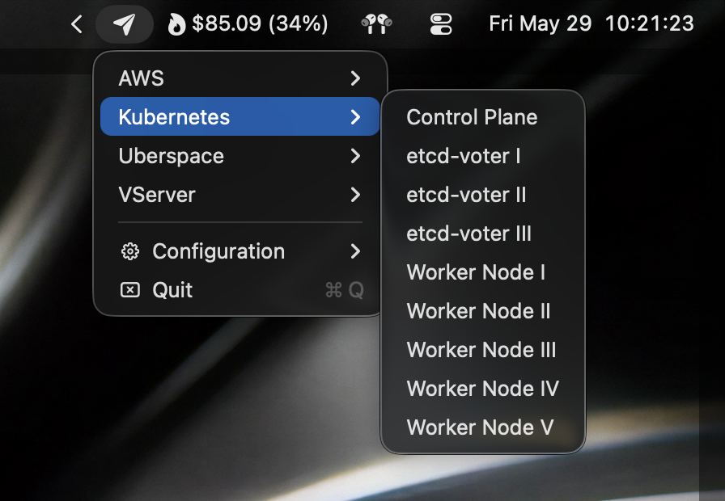

<p align="center">
  
</p>

<h1 align="center">Shuttle</h1>

<p align="center">
  A Rust rewrite of the classic macOS Shuttle menu-bar app for launching SSH sessions, terminal commands, and URLs from a simple JSON config, with experimental YAML support.
</p>

<p align="center">
  <a href="https://github.com/philipbrembeck/shuttle/releases/latest"><strong>Download latest release</strong></a>  &middot; <a href="https://philipbrembeck.github.io/shuttle/">Website</a> &middot; <a href="#install">Installation instructions</a> &middot; <a href="#config-basics">Config documentation</a>
</p>

---

> [!NOTE]
> This repository is experimental software provided as-is, ported to Rust exclusively using AI Agents. Use it at your own risk; we assume no liability for issues, data loss, security problems, or operational impact.

## What is Shuttle?

Shuttle lives in your macOS menu bar. Click the icon, choose a host or command, and Shuttle opens it in your preferred terminal.

This project is a fork and Rust rewrite of the original, now-unmaintained [Shuttle](https://github.com/fitztrev/shuttle) project.

Use it for:

- SSH shortcuts for servers and environments
- Nested menus for teams, projects, or datacenters
- Commands that should open in Terminal.app, iTerm, Ghostty, cmux, or background `screen`
- URLs such as dashboards, SSH URLs, or local files
- Importing hosts from `~/.ssh/config`

<p align="center">
    
</p>

## Install

### Download the app

1. Open the [latest release](https://github.com/philipbrembeck/shuttle/releases/latest).
2. Download `Shuttle.zip` from **Assets**.
3. Unzip it.
4. Drag `Shuttle.app` into `/Applications`.
5. Open Shuttle from `/Applications`.

Because current release builds may not be Apple-notarized yet, macOS can show a warning that the app is damaged or from an unidentified developer. If that happens, run:

```sh
xattr -dr com.apple.quarantine /Applications/Shuttle.app
open /Applications/Shuttle.app
```

Future notarized releases should not need this workaround, but notarizationm is not on the roadmap atm.

### Build from source

Requirements: macOS and the Rust toolchain.

```sh
./scripts/check-rust.sh
./scripts/build-rust-app.sh
cp -R target/release/Shuttle.app /Applications/
open /Applications/Shuttle.app
```

## First run

On first launch, Shuttle creates a stable JSON config file at:

```text
~/.config/shuttle/config.json
```

Open the menu-bar icon and choose **Configuration** to edit, import, or export your config. JSON remains the generated default and backwards-compatible format.

## Quick config example

```json
{
  "terminal": "Ghostty",
  "open_in": "tab",
  "show_ssh_config_hosts": true,
  "hosts": [
    { "cmd": "ssh prod.example.com", "name": "Production" },
    { "cmd": "https://grafana.example.com", "name": "Grafana" },
    {
      "Staging": [
        { "cmd": "ssh web-1.staging", "name": "Web 1" },
        { "cmd": "ssh db-1.staging", "name": "Database" }
      ]
    }
  ]
}
```

Save the file, then reopen the Shuttle menu. The app reloads when the config changes.

### Experimental YAML config

YAML is available as an experimental, opt-in format for hand-written configs. Shuttle never creates YAML automatically, but if you create one of the standard YAML files it takes precedence over the standard JSON file.

Main config precedence:

1. `~/.shuttle.path`
2. `~/.config/shuttle/config.yaml`
3. `~/.config/shuttle/config.yml`
4. `~/.config/shuttle/config.json`
5. legacy `~/.shuttle.json` migration/fallback

Alternate config precedence:

1. `~/.shuttle-alt.path`
2. `~/.config/shuttle/alt.yaml`
3. `~/.config/shuttle/alt.yml`
4. `~/.config/shuttle/alt.json`
5. legacy `~/.shuttle-alt.json`

Use JSON for stable/default/backwards-compatible configs, machine-generated configs, and existing `jq` or `python3 -m json.tool` workflows. Use YAML for hand-written configs where comments and deeply nested menus are easier to maintain, accepting its experimental status.

A copyable YAML example is available at [`resources/shuttle.example.yaml`](resources/shuttle.example.yaml):

```yaml
terminal: Ghostty
open_in: tab
show_ssh_config_hosts: true
hosts:
  - cmd: ssh prod.example.com
    name: Production
  - Engineering:
      - cmd: ssh web-1.staging
        name: Web 1
```

## Config basics

### Global settings

| Key                     | Description                        | Values                                             |
| ----------------------- | ---------------------------------- | -------------------------------------------------- |
| `editor`                | App used by the Configuration menu | `"default"`, `"nano"`, `"vi"`, etc.                |
| `launch_at_login`       | Start Shuttle on login             | `true` / `false`                                   |
| `terminal`              | Preferred terminal                 | `"Terminal.app"`, `"iTerm"`, `"Ghostty"`, `"cmux"` |
| `open_in`               | Default launch mode                | `"new"`, `"tab"`, `"current"`, `"virtual"`         |
| `show_ssh_config_hosts` | Import SSH config hosts            | `true` / `false`                                   |
| `backend`               | Explicit backend override          | See [Backends](#backends)                          |
| `strategy`              | Backend strategy hint              | See [Strategies](#strategies)                      |

### Host settings

| Key          | Description                                               |
| ------------ | --------------------------------------------------------- |
| `cmd`        | Command, URL, or SSH command to launch                    |
| `name`       | Menu label                                                |
| `inTerminal` | Per-host mode: `"new"`, `"tab"`, `"current"`, `"virtual"` |
| `theme`      | Terminal profile/theme                                    |
| `title`      | Terminal window/tab title                                 |
| `backend`    | Per-host backend override                                 |
| `strategy`   | Per-host strategy override                                |

### Nested menus

Wrap hosts in a named object:

```json
{
  "hosts": [
    {
      "Production": [
        { "cmd": "ssh web1", "name": "Web 1" },
        { "cmd": "ssh web2", "name": "Web 2" }
      ]
    }
  ]
}
```

### Sorting and separators

Prefix a menu item with `[aaa]` to control sort order. Add `[---]` to place a separator after it. These markers are hidden in the menu.

```json
{ "cmd": "ssh prod", "name": "[aaa][---]Production" }
```

### SSH config import

When `show_ssh_config_hosts` is enabled, Shuttle reads:

- `~/.ssh/config`
- `/etc/ssh/ssh_config`

Imported hosts appear as `ssh <alias>` menu items. You can customize names with comments:

```sshconfig
Host prod
  HostName prod.example.com
  # shuttle.name Servers/Production
```

Hosts with wildcards, dot-prefixed names, or matching ignore filters are skipped.

### Alternate and custom config paths

To use a custom main config path:

```sh
echo '/path/to/config.json' > ~/.shuttle.path
```

Override files must point to paths ending in `.json`, `.yaml`, or `.yml`; missing or unknown extensions fail with a config error.

Remove it to return to the default:

```sh
rm ~/.shuttle.path
```

An optional alternate config can live at `~/.shuttle-alt.path`, `~/.config/shuttle/alt.yaml`, `~/.config/shuttle/alt.yml`, `~/.config/shuttle/alt.json`, or legacy `~/.shuttle-alt.json`. Alternate hosts are appended to the main menu.

Legacy `~/.shuttle.json` is migrated automatically to `~/.config/shuttle/config.json` when no new config exists yet.

## Backends

The easiest way to choose a backend is the `terminal` key:

```json
{ "terminal": "Terminal.app" }
{ "terminal": "iTerm" }
{ "terminal": "Ghostty" }
{ "terminal": "cmux" }
```

For precise control, use `backend` globally or per host.

| Backend             | Config value                    | Notes                                                                          |
| ------------------- | ------------------------------- | ------------------------------------------------------------------------------ |
| Terminal.app        | `terminal-app`                  | Supports new windows, tabs, current window, and virtual mode via AppleScript   |
| iTerm               | `iterm-stable`, `iterm-nightly` | Supports stable/nightly iTerm variants via AppleScript                         |
| Ghostty open        | `ghostty-open`                  | Opens new Ghostty windows without Automation permission                        |
| Ghostty AppleScript | `ghostty-applescript`           | Supports tabs/current windows; requires Ghostty 1.3+ and Automation permission |
| cmux CLI            | `cmux-cli`                      | Sends commands to cmux workspaces/focused surfaces                             |
| cmux socket         | `cmux-socket`                   | Uses cmux Unix socket JSON API                                                 |
| screen              | `screen`                        | Runs commands detached in the background                                       |

### Strategies

| Strategy      | Description                               |
| ------------- | ----------------------------------------- |
| `default`     | Backend-specific default                  |
| `workspace`   | Target a named workspace, mainly for cmux |
| `socket`      | Use socket API, mainly for cmux           |
| `applescript` | Use AppleScript automation                |

Backend precedence:

1. Per-host `backend` / `strategy`
2. Top-level `backend` / `strategy`
3. Legacy `terminal`, `iTerm_version`, and `open_in`
4. Default: Terminal.app, tab mode

## Menu actions

The menu contains:

- Configured hosts and imported SSH hosts
- **Check for Updates…** when update support is available
- **Configuration** for editing/importing/exporting config
- **About Shuttle**
- **Quit**

## Troubleshooting

See [`docs/troubleshooting-rust-port.md`](docs/troubleshooting-rust-port.md) for common issues:

- macOS quarantine / damaged app warnings
- Config parse errors
- Automation permissions
- Missing terminal apps
- cmux socket access

## Development

```sh
./scripts/check-rust.sh
./scripts/build-rust-app.sh
./scripts/package-release.sh
```

Useful docs:

- [`docs/terminal-backends.md`](docs/terminal-backends.md)
- [`docs/packaging-rust-port.md`](docs/packaging-rust-port.md)
- [`docs/development/rust-port.md`](docs/development/rust-port.md)
